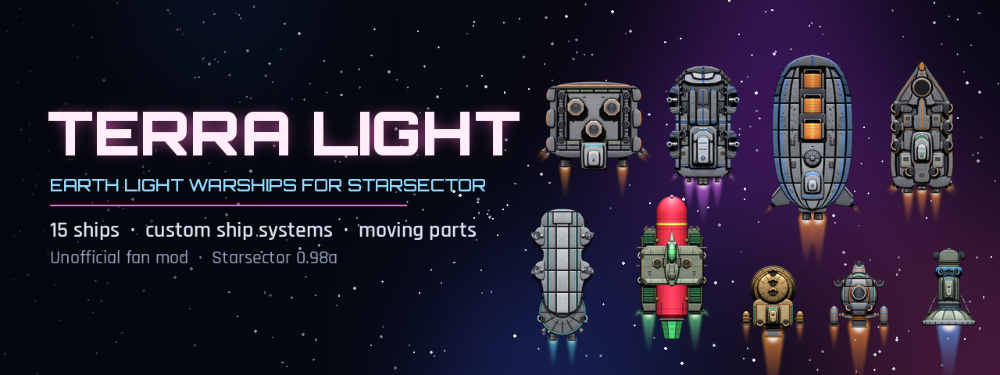
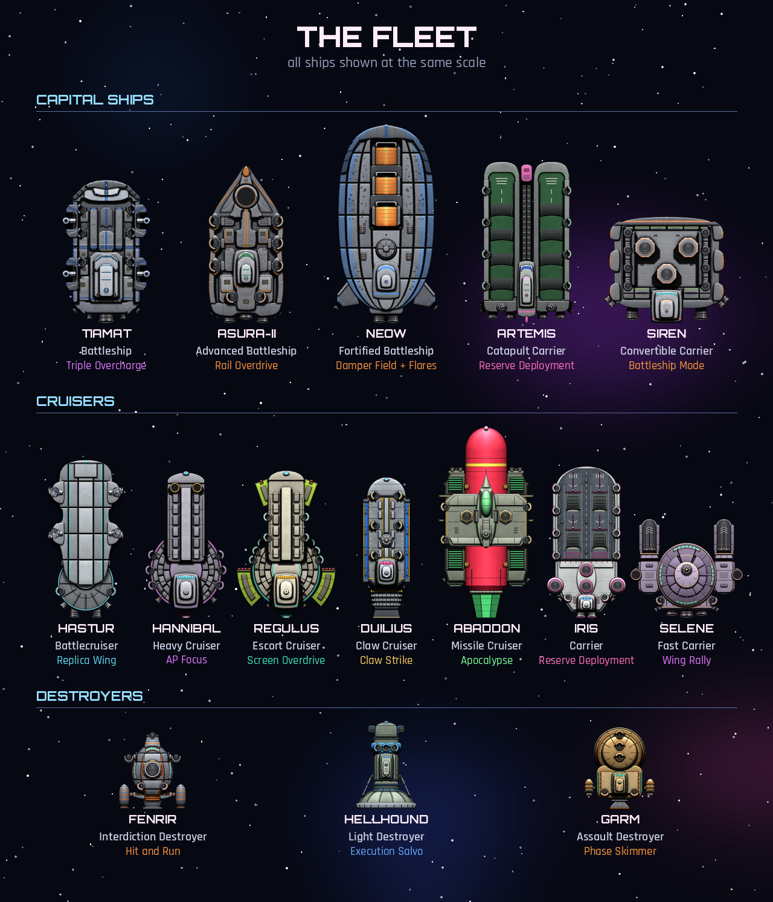

  

  
  
  
  

<b>Bringing the Earth Light SNES spaceships and things over to the beloved game Starsector!</b>

---

**Terra Light** adds 15 Union warships from *Earth Light* (Hudson Soft, 1992) to Starsector, redrawn top-down
in the Starsector style. Every ship has its own ship system, and several have working moving parts:
swivelling drives, retracting boosters and a carrier deck that converts into a battleship.

## Download and install

1. Go to **[Releases](https://github.com/skykyrie/starsector-terralight/releases)** and download the latest `TerraLight_vX.Y.Z.zip`.
   *(Don't use the green "Code → Download ZIP" button - that is the development copy.)*
2. Unzip it into your `Starsector/mods/` folder, so you have `Starsector/mods/TerraLight/mod_info.json`.
3. Start the Starsector launcher and tick **Terra Light**.

**Requires:** Starsector 0.98a-RC8. **No other mods needed.**
**Save games:** adds ships only, so it should be safe to add to an existing save (back up first). Ships appear on Independent military markets.
**Console Commands:** `addship tl_tiamat_standard` (every ship has `tl_<name>_standard` and `tl_<name>_Hull`).

## The fleet

## Ship systems

| Class | Ship | System | What it does |
|---|---|---|---|
| Capital | **Tiamat** | Triple Overcharge | Energy weapons fire twice as fast for half the flux, +25% damage. Four triple beam cannons that can all converge ahead. |
| Capital | **Asura-II** | Rail Overdrive | Ballistic rate of fire x2, half flux, faster slugs and a speed surge. Twin quad railguns (upper kinetic, lower explosive). |
| Capital | **Neow** | Damper Field + Flare Screen | No shield. Right-click fires flares from 8 tubes all round the hull. Armageddon torpedo tubes. |
| Capital | **Artemis** | Reserve Deployment | Twin-deck catapult carrier with 8 fighter bays. |
| Capital | **Siren** | Battleship Mode | Toggle: carrier mode (guns folded under the deck) or battleship mode (deck converts, 3 main guns rise, fighter replacement paused). |
| Cruiser | **Hastur** | Replica Wing | Every wing launches a full replica set for 20 seconds. Built-in twin beam cannons; the command ball is a separate module. |
| Cruiser | **Hannibal** | AP Focus | Energy weapons +60% damage, +30% range, +50% against capital ships. |
| Cruiser | **Regulus** | Screen Overdrive | Double damage to fighters and missiles, +50% against destroyers. Bubble missile pods. |
| Cruiser | **Duilius** | Claw Strike | Launches 8 grapple claws that ignore shields. Stores 2 volleys. |
| Cruiser | **Abaddon** | Apocalypse | Once per battle, needs a locked target: boosters slide open, the warhead homes in and detonates with a huge blast. No shield, flares on right-click. |
| Cruiser | **Iris** | Reserve Deployment | Front-line carrier with 4 bays and missile mounts. |
| Cruiser | **Selene** | Wing Rally | Fast carrier: repairs and boosts its fighters. |
| Destroyer | **Fenrir** | Hit and Run | Speed and agility burst; side boosters swivel with the ship's manoeuvres. |
| Destroyer | **Hellhound** | Execution Salvo | Rapid fire with bonus hull damage, missiles reloaded. The lamp-head drive swivels; the command tower is a module holding 3 under-hull guns. |
| Destroyer | **Garm** | Phase Skimmer | Assault destroyer with a quad railgun under its nose and swivelling thruster pods. |

## Features

- **Under-hull mounts** - some guns sit beneath the armour with only their barrels showing, yet stay fully refittable.
- **Moving parts** - swivelling drives and booster pods, Abaddon's retracting boosters, Siren's converting deck.
- **Ready-to-fly loadouts** - standard variants come fitted with weapons, hullmods and S-mods.
- **Self-contained** - no library mods required; all ids use the `tl_` prefix to avoid clashes.

## Compatibility

Works on its own and alongside the usual library mods (LazyLib, MagicLib, LunaLib, GraphicsLib...).
It only adds entries to `settings.json`, `engine_styles.json` and the Independent faction; it replaces no vanilla files.

## Feedback and bugs

Open an [issue](https://github.com/skykyrie/starsector-terralight/issues). If the game fails to load,
attach the end of `starsector-core/starsector.log`.

## License, credits and disclaimer

- **No copyright is claimed.** The mod's own material is dedicated to the public domain under **CC0 1.0** ([LICENSE](LICENSE)).
  The Earth Light designs, names and setting are **not** covered and remain with their rights holders. Details: [NOTICE.md](NOTICE.md).
- **Unofficial fan work.** *Earth Light* belongs to Hudson Soft / Konami; Starsector belongs to Fractal Softworks.
  This project is not affiliated with or endorsed by them, is non-commercial, and will be taken down if a rights holder asks.
- **Made with AI.** The sprites, scripts and data were generated with an AI agent (Claude, by Anthropic),
  directed, revised and play-tested by the maintainer, **Skykyrie**.
